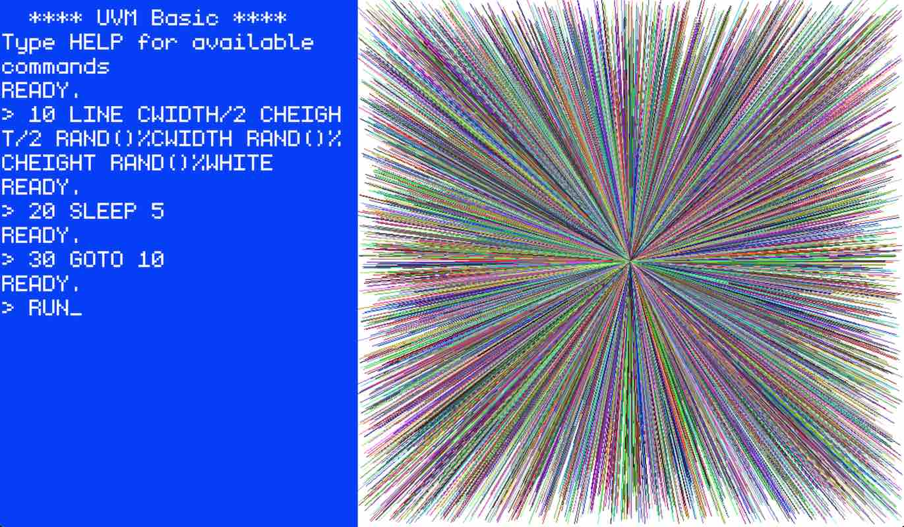
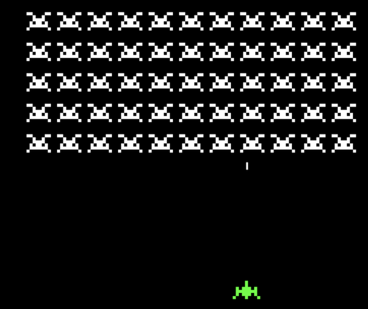

# UVM

**NOTE: this project is very much a work in progress. You're likely to run
into bugs and missing features. I'm looking for collaborators who share the vision
and want to help me make it happen.**

<p align="center">
    &nbsp;
    &nbsp;
    
</p>

A minimalistic virtual machine designed to run self-contained applications. UVM is intended as a platform to distribute
programs that will not break and to combat code rot. It also aims to be conceptually simple, easy to understand, easy
to target, fun to work with and approachable to newcomers. It may also be valuable as a teaching tool. There is a short
4-minute [overview of UVM](https://www.youtube.com/watch?v=q9-o45B_qsA)
on YouTube if you'd like to see a quick survey.

Contents:
- [Features](#features)
- [Build Instructions](#build-instructions)
- [Codebase Organization](#codebase-organization)
- [Vision and Motivation](doc/vision.md)
- [Design and Architecture](doc/design.md)
- [Subsystems and System Calls](doc/syscalls.md)
- [Planning and Evolution](doc/planning.md)

If you think that UVM is cool, you can support my work via [GitHub Sponsors](https://github.com/sponsors/maximecb) :heart:

## Features

Current features:
- Stack-based bytecode interpreter
- Variable-length instructions for compactness
- Untyped design for simplicity
- Little-endian byte ordering (like x86, ARM & RISC-V)
- 32-bit and 64-bit integer ops, 32-bit floating-point support
- Separate flat, linear address spaces for code and data
- Built-in, easy to use [assembler](vm/src/asm.rs) with a [simple syntax](vm/examples)
- Event-driven event execution model compatible with async operations
- Easy to use frame buffer to draw RGB graphics with no boilerplate
- Easy to use audio output API with no boilerplate

Planned future features:
- Async file and network I/O with callbacks
  - Synchronous I/O possible as well
- Fast JIT compiler based on dynamic binary translation and basic block versioning
  - Expected performance ~80% of native speed (maybe more?)
  - Near-instant warmup
- Permission system to safely sandbox apps without granting access to entire computer
- Ability to compile without SDL and without graphics/audio for headless server-side use
- Ability to encode metadata such as author name and app icon into app image files
- Ability to suspend running programs and save them to a new app image file

## Build Instructions

Dependencies:
- The [Rust toolchain](https://www.rust-lang.org/tools/install)
- The [SDL2 libraries](https://wiki.libsdl.org/SDL2/Installation)

### Installing Rust and SDL2 on macOS

Install the SDL2 package:
```sh
brew install sdl2
```

Add this to your `~/.zprofile`:
```sh
export LIBRARY_PATH="$LIBRARY_PATH:$(brew --prefix)/lib"
```

Install the Rust toolchain:
```sh
curl --proto '=https' --tlsv1.2 -sSf https://sh.rustup.rs | sh
```

### Installing Rust and SDL2 on Debian/Ubuntu

Install the SDL2 package:
```sh
sudo apt-get install libsdl2-dev
```

Install the Rust toolchain:
```sh
curl --proto '=https' --tlsv1.2 -sSf https://sh.rustup.rs | sh
```

### Installing Rust and SDL2 on Windows

Follow the Windows-specific instructions to [install the Rust toolchain](https://www.rust-lang.org/tools/install).

Get `SDL2.dll` from one of [SDL2 Releases](https://github.com/libsdl-org/SDL/releases).

Copy `SDL2.dll` (unzip) to the `vm/` folder.

### Compiling the Project

```sh
cd vm
cargo build
```

To run an asm file with UVM:
```sh
cargo run examples/fizzbuzz.asm
```

There is also a toy C compiler in the `ncc` directory, along with many [example C programs](ncc/examples) that run on UVM:
```sh
cd ncc
./build_and_run.sh examples/snake.c
```

### Running the Test Suite

Run `cargo test` from the `vm`, and `ncc` directories.

## Codebase Organization

The repository is organized into a 3 different subprojects, each of which is a Rust codebase which can be compiled with `cargo`:

- `/vm` : The implementation of the UVM virtual machine itself
  - [`/vm/examples/*`](vm/examples): Example assembly programs that can be run by UVM
- `/ncc`: An implementation of a toy C compiler that outputs UVM assembly
  - [`/ncc/README.md`](ncc/README.md): documentation for the NCC compiler.
  - [`/ncc/examples/*`](ncc/examples): Example C source files that can be compiled by NCC
- `/api`: A system to document and automatically export bindings for UVM system calls and constants.
  - `/api/syscalls.json`: Declarative list of system calls exposed by UVM.

The `ncc` compiler is, at the time of this writing, incomplete in that it lacks some C features and the error messages need improvement. This compiler
was implemented to serve as an example of how to write a compiler that targets UVM, and to write some library code to be used by other programs. Over
time, the `ncc` compiler will be improved. Despite its limitations, it is still usable to write small programs. Contributions to it are welcome.

The `api` directory contains JSON files that represent a declarative list of system calls, constants and the permission system that UVM exposes
to programs running on it. This is helpful for documentation purposes, or if you want to build a compiler that targets UVM. The directory also contains
code that automatically generates [markdown documentation](doc/syscalls.md), Rust constants and [C definitions](ncc/include/uvm/syscalls.h) for system calls.

## Open Source License

The code for UVM, NCC and associated tools is shared under the [Apache-2.0 license](https://github.com/maximecb/uvm/blob/main/LICENSE).

The examples under the `vm/examples` and `ncc/examples` directories are shared under the [Creative Commons CC0](https://creativecommons.org/publicdomain/zero/1.0/) license.

## Contributing

There is a lot of work to be done to get this project going and contributions are welcome.

A good first step is to look at open issues and read the available documentation. Another easy way to contribute
is to create new example programs showcasing cool things you can do with UVM, or to open issues to report bugs.
If you do report bugs, please provide as much context as possible, and the smallest reproduction you can
come up with.

You can also search the codebase for TODO notes:
```sh
grep -IRi "todo"
```

In general, smaller pull requests are easier to review and have a much higher chance of getting merged than large
pull requests. If you would like to add a new, complex feature or refactor the design of UVM, I recommend opening
an issue or starting a discussion about your proposed change first.

Also please keep in mind that one of the core principles of UVM is to minimize dependencies to keep the VM easy
to install and easy to port. Opening a PR that adds dependencies to multiple new packages and libraries is
unlikely to get merged. Again, if you have a valid argument in favor of doing so, please open a discussion to
share your point of view.
